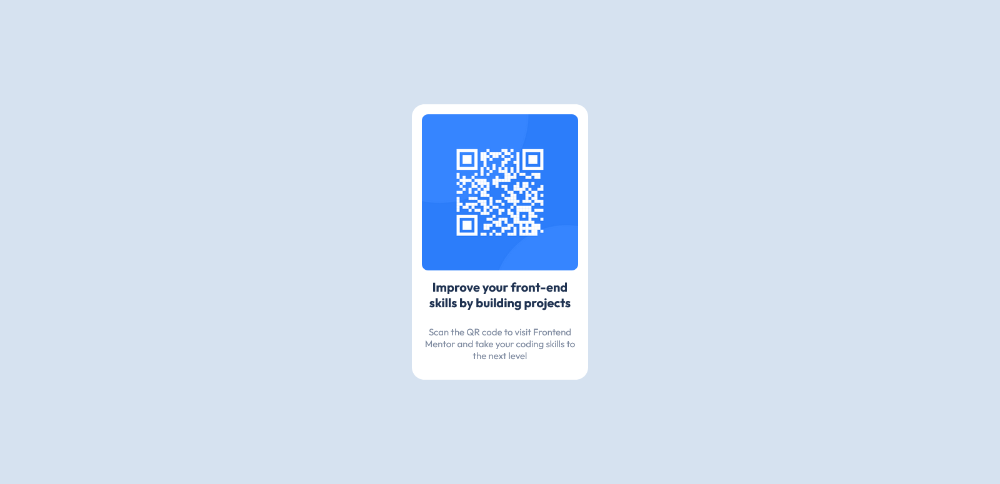

# Frontend Mentor - QR code component solution

This is a solution to the [QR code component challenge on Frontend Mentor](https://www.frontendmentor.io/challenges/qr-code-component-iux_sIO_H). 

## Table of contents

- [Overview](#overview)
  - [Screenshot](#screenshot)
  - [Links](#links)
- [My process](#my-process)
  - [Built with](#built-with)
  - [What I learned](#what-i-learned)
  - [Continued development](#continued-development)
- [Author](#author)
- [Acknowledgments](#acknowledgments)

## Overview

### Screenshot

### Links

- Solution URL: [https://github.com/ajosh87/Challenge_One_qr-code/blob/main/public/home.html]
- Live Site URL: [Add live site URL here](https://your-live-site-url.com)

## My process

### Built with

- Semantic HTML5 markup
- CSS custom properties
- Mobile-first workflow

### What I learned

This was my first ever HTML and CSS code as soon as I started learning them.

### Continued development

I wish to repeat this with REACT while I learn it. My idea would be to randomize the QR code each time the page is refereshed.

## Author

- Website - [Add your name here](https://www.your-site.com)
- Frontend Mentor - [@ajosh87](https://www.frontendmentor.io/profile/ajosh87)

## Acknowledgments

This is an inspiration by watching YouTube video by SuperSimpleDev (https://www.youtube.com/watch?v=G3e-cpL7ofc)
